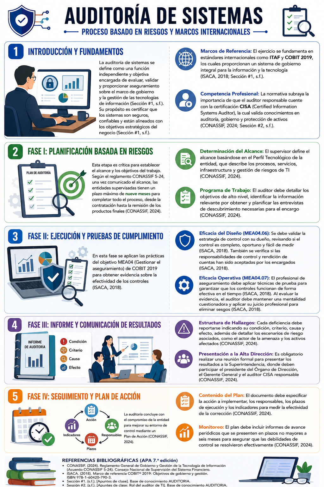
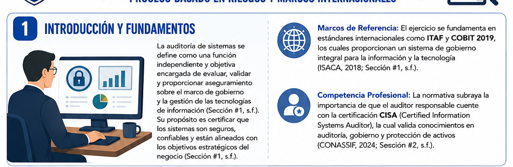
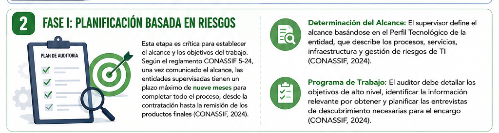
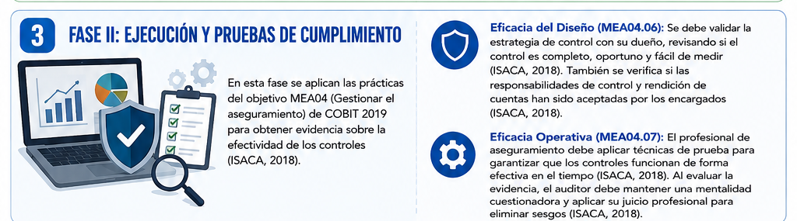
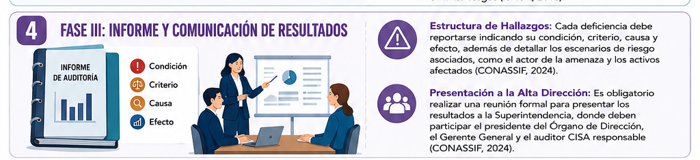
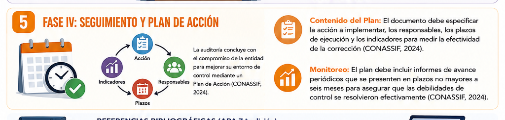
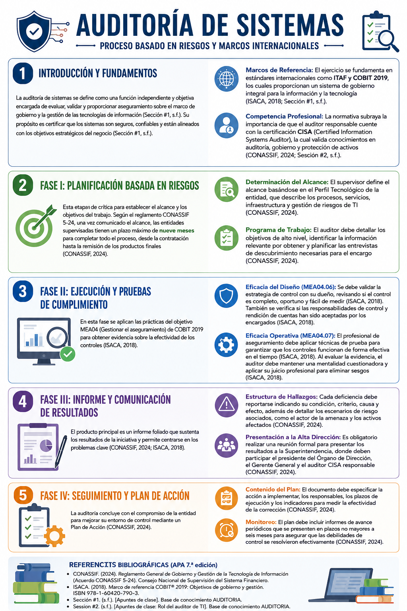

# Proceso de Auditoría de Sistemas

<p align="center">
  
</p>

> La auditoría de sistemas es una función independiente y objetiva orientada a evaluar el gobierno, la gestión, los controles y los riesgos relacionados con las tecnologías de información.

---

## Contenido

1. [Introducción y fundamentos](#1-introducción-y-fundamentos)
2. [Fase I: Planificación basada en riesgos](#2-fase-i-planificación-basada-en-riesgos)
3. [Fase II: Ejecución y pruebas de cumplimiento](#3-fase-ii-ejecución-y-pruebas-de-cumplimiento)
4. [Fase III: Informe y comunicación de resultados](#4-fase-iii-informe-y-comunicación-de-resultados)
5. [Fase IV: Seguimiento y plan de acción](#5-fase-iv-seguimiento-y-plan-de-acción)
6. [Resumen visual](#6-resumen-visual)
7. [Referencias bibliográficas](#7-referencias-bibliográficas)

---

## 1. Introducción y fundamentos

<p align="center">
  
</p>

La **auditoría de sistemas** se define como una función independiente y objetiva encargada de evaluar, validar y proporcionar aseguramiento sobre el marco de gobierno y la gestión de las tecnologías de información **(Sección #1, s.f.)**.

Su propósito es certificar que los sistemas sean seguros, confiables y estén alineados con los objetivos estratégicos del negocio **(Sección #1, s.f.)**.

### Marcos de referencia

El ejercicio se fundamenta en estándares internacionales como **ITAF** y **COBIT 2019**, los cuales proporcionan un sistema de gobierno integral para la información y la tecnología **(ISACA, 2018; Sección #1, s.f.)**.

### Competencia profesional

La normativa subraya la importancia de que el auditor responsable cuente con la certificación **CISA** (*Certified Information Systems Auditor*), la cual valida conocimientos en auditoría, gobierno y protección de activos **(CONASSIF, 2024; Session #2, s.f.)**.

> **Idea central:** el auditor de TI proporciona aseguramiento independiente sobre la seguridad, confiabilidad y alineación estratégica de los sistemas de información.

---

## 2. Fase I: Planificación basada en riesgos

<p align="center">
  
</p>

Esta etapa es crítica para establecer el alcance y los objetivos del trabajo.

Según el reglamento **CONASSIF 5-24**, una vez comunicado el alcance, las entidades supervisadas tienen un plazo máximo de **nueve meses** para completar todo el proceso, desde la contratación hasta la remisión de los productos finales **(CONASSIF, 2024)**.

### Determinación del alcance

El supervisor define el alcance basándose en el **Perfil Tecnológico** de la entidad, que describe:

- Los procesos.
- Los servicios.
- La infraestructura.
- La gestión de riesgos de TI.

**Fuente:** CONASSIF (2024).

### Programa de trabajo

El auditor debe:

- Detallar los objetivos de alto nivel.
- Identificar la información relevante que debe obtener.
- Planificar las **entrevistas de descubrimiento** necesarias para el encargo.

**Fuente:** CONASSIF (2024).

```text
Perfil tecnológico
        ↓
Identificación de riesgos
        ↓
Definición del alcance
        ↓
Objetivos de auditoría
        ↓
Programa de trabajo
```

---

## 3. Fase II: Ejecución y pruebas de cumplimiento

<p align="center">
  
</p>

En esta fase se aplican las prácticas del objetivo **MEA04: Gestionar el aseguramiento** de COBIT 2019 para obtener evidencia sobre la efectividad de los controles **(ISACA, 2018)**.

### Eficacia del diseño — MEA04.06

Se debe validar la estrategia de control con su dueño, revisando si el control es:

- Completo.
- Oportuno.
- Fácil de medir.

También se verifica si las responsabilidades de control y rendición de cuentas han sido aceptadas por las personas encargadas **(ISACA, 2018)**.

### Eficacia operativa — MEA04.07

El profesional de aseguramiento debe aplicar técnicas de prueba para garantizar que los controles funcionan de forma efectiva en el tiempo **(ISACA, 2018)**.

Al evaluar la evidencia, el auditor debe:

- Mantener una mentalidad cuestionadora.
- Aplicar su juicio profesional.
- Identificar y eliminar posibles sesgos.
- Sustentar sus conclusiones con evidencia.

**Fuente:** ISACA (2018).

| Evaluación | Pregunta principal |
|---|---|
| **Eficacia del diseño** | ¿El control fue diseñado correctamente para responder al riesgo? |
| **Eficacia operativa** | ¿El control funciona realmente y de manera sostenida? |

---

## 4. Fase III: Informe y comunicación de resultados

<p align="center">
  
</p>

El producto principal es un informe foliado que sustenta los resultados de la iniciativa y permite centrarse en los problemas clave **(CONASSIF, 2024; ISACA, 2018)**.

### Estructura de los hallazgos

Cada deficiencia debe reportarse indicando:

| Elemento | Descripción |
|---|---|
| **Condición** | Situación encontrada durante la auditoría. |
| **Criterio** | Norma, política o requisito utilizado para evaluar la situación. |
| **Causa** | Motivo que originó la deficiencia. |
| **Efecto** | Consecuencia real o potencial de la situación encontrada. |

Además, se deben detallar los escenarios de riesgo asociados, incluyendo:

- El actor de la amenaza.
- Los activos afectados.
- Las posibles consecuencias.
- La exposición de la organización.

**Fuente:** CONASSIF (2024).

### Presentación a la Alta Dirección

Es obligatorio realizar una reunión formal para presentar los resultados a la Superintendencia.

En esta reunión deben participar:

- El presidente del Órgano de Dirección.
- El Gerente General.
- El auditor CISA responsable.

**Fuente:** CONASSIF (2024).

> **Hallazgo de auditoría:** condición + criterio + causa + efecto.

---

## 5. Fase IV: Seguimiento y plan de acción

<p align="center">
  
</p>

La auditoría concluye con el compromiso de la entidad para mejorar su entorno de control mediante un **Plan de Acción** **(CONASSIF, 2024)**.

### Contenido del plan

El documento debe especificar:

- La acción que se implementará.
- Las personas responsables.
- Los plazos de ejecución.
- Los indicadores para medir la efectividad de la corrección.

**Fuente:** CONASSIF (2024).

### Monitoreo

El plan debe incluir informes de avance periódicos que se presenten en plazos no mayores a **seis meses**, con el fin de asegurar que las debilidades de control fueron resueltas efectivamente **(CONASSIF, 2024)**.


---

## 6. Resumen visual

<p align="center">
  
</p>

### Flujo general del proceso


| Etapa | Resultado principal |
|---|---|
| **Introducción y fundamentos** | Comprensión del propósito, los marcos y las competencias profesionales. |
| **Planificación** | Alcance, objetivos y programa de trabajo. |
| **Ejecución** | Evidencia sobre el diseño y la operación de los controles. |
| **Informe** | Hallazgos y comunicación formal de resultados. |
| **Seguimiento** | Plan de acción, responsables, plazos e indicadores. |

---

## 7. Referencias bibliográficas

- **CONASSIF**. (2024). *Reglamento General de Gobierno y Gestión de la Tecnología de Información (Acuerdo CONASSIF 5-24)*. Consejo Nacional de Supervisión del Sistema Financiero.

- **ISACA**. (2018). *Marco de referencia COBIT® 2019: Objetivos de gobierno y gestión*. ISBN 978-1-60420-790-3.

- **Sección #1**. (s.f.). *Apuntes de clase*. Base de conocimiento AUDITORIA.

- **Session #2**. (s.f.). *Apuntes de clase: Rol del auditor de TI*. Base de conocimiento AUDITORIA.
