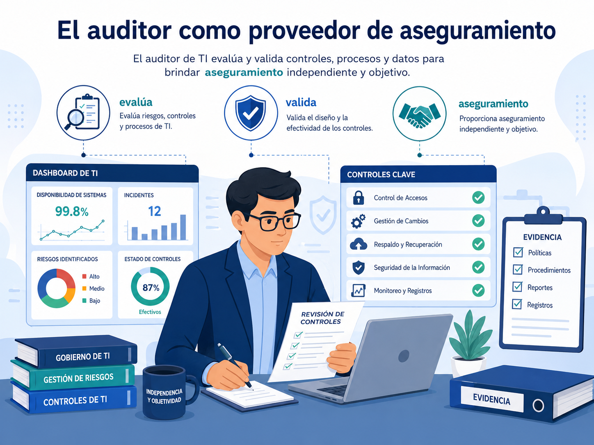
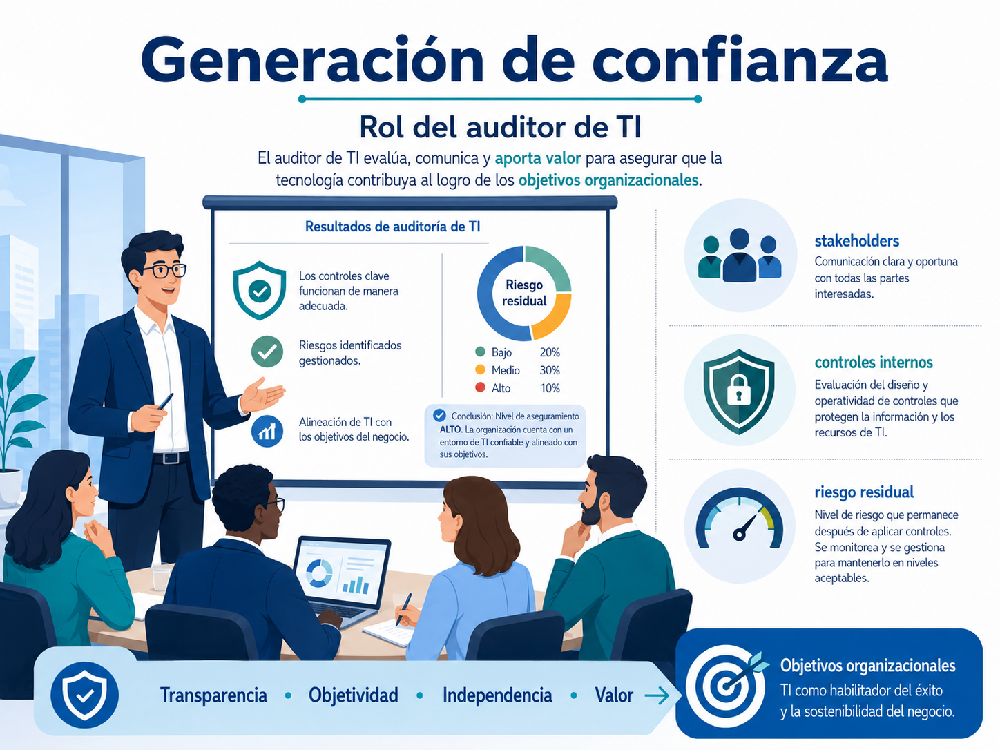
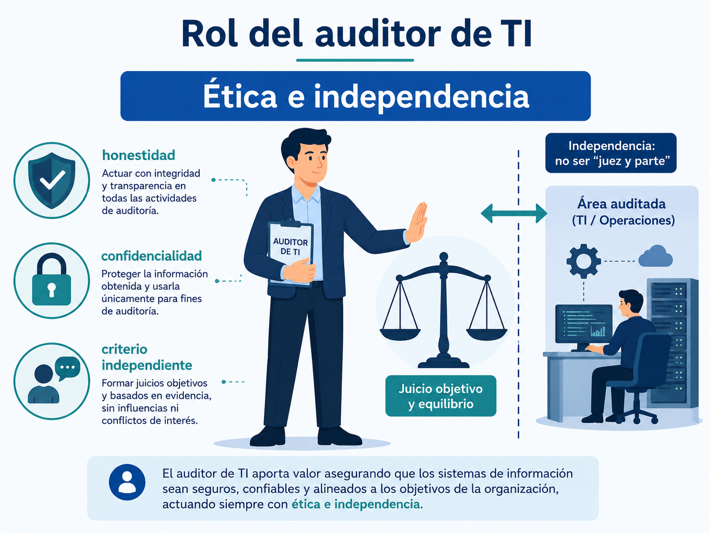
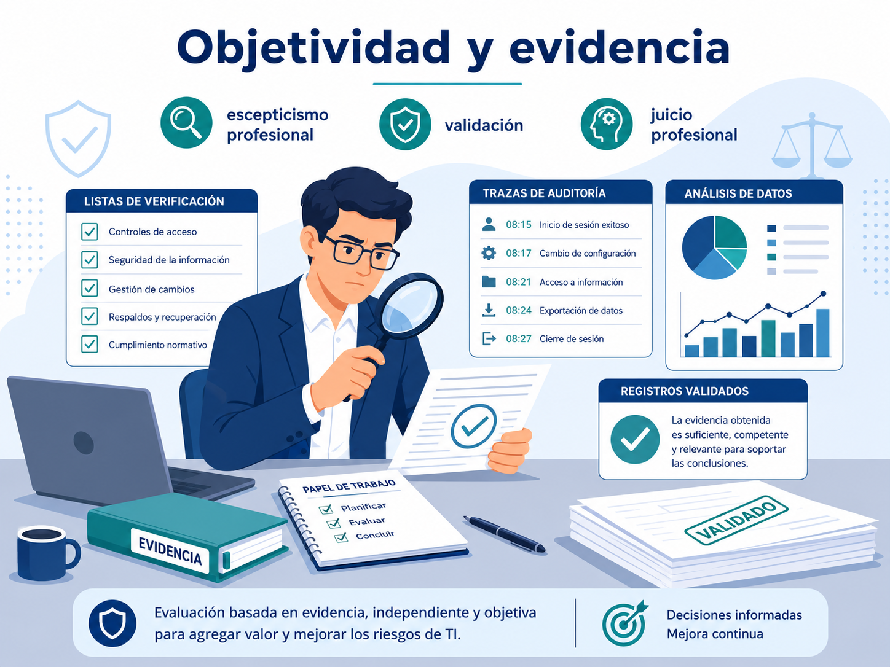
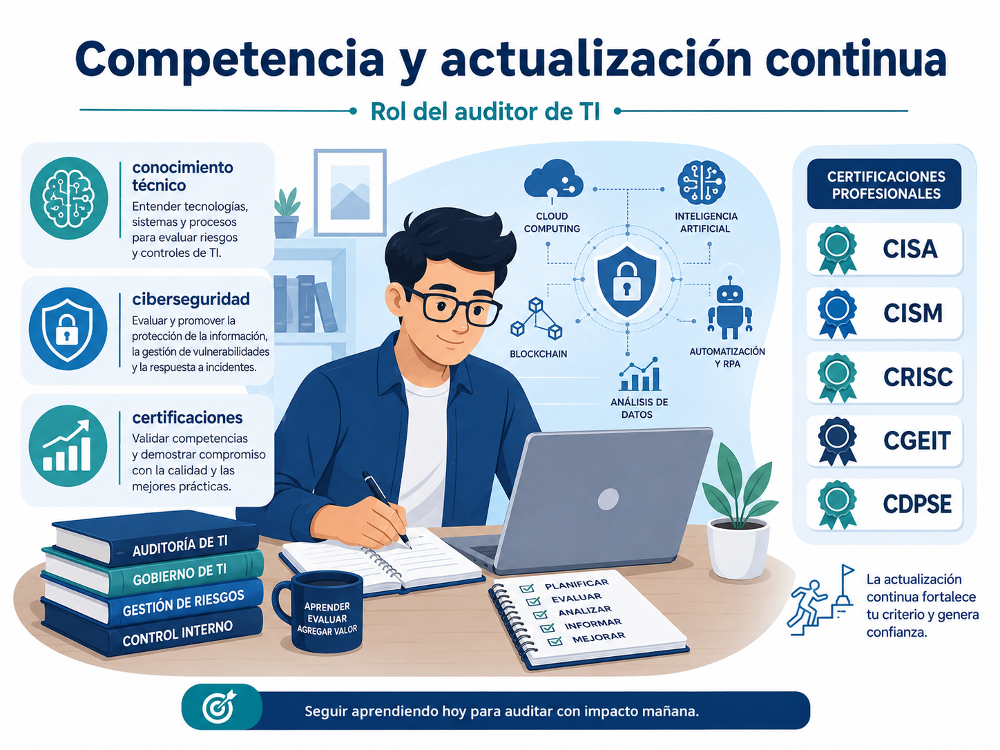
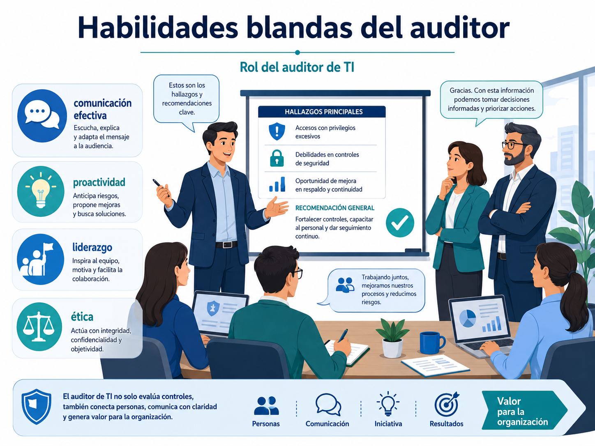

# Sesión 2: Rol del auditor de TI

## Contenido

1. [El auditor como proveedor de aseguramiento](#1-el-auditor-como-proveedor-de-aseguramiento)
2. [Generación de confianza para las partes interesadas](#2-generación-de-confianza-para-las-partes-interesadas)
3. [Principios éticos del auditor de TI](#3-principios-éticos-del-auditor-de-ti)
4. [Independencia del auditor](#4-independencia-del-auditor)
5. [Objetividad y escepticismo profesional](#5-objetividad-y-escepticismo-profesional)
6. [Evaluación basada en evidencia](#6-evaluación-basada-en-evidencia)
7. [Competencia profesional y actualización continua](#7-competencia-profesional-y-actualización-continua)
8. [Certificaciones profesionales](#8-certificaciones-profesionales)
9. [Habilidades blandas del auditor de TI](#9-habilidades-blandas-del-auditor-de-ti)

---

## 1. El auditor como proveedor de aseguramiento

La auditoría de TI se define como una actividad especializada encargada de evaluar, validar y proporcionar aseguramiento sobre el marco de gobierno y la gestión de las tecnologías de información [1, 2].

Su propósito es facilitar que la dirección ofrezca una garantía adecuada y sostenible a la empresa mediante revisiones y actividades independientes [3, 4].

A diferencia de la gestión, que opera los sistemas, la auditoría valida que dicha operación se realice conforme a las normas y controles establecidos [5, 6].

  

---

## 2. Generación de confianza para las partes interesadas

El rol del auditor es vital para dar información transparente a las partes interesadas (*stakeholders*) sobre la idoneidad del sistema de controles internos [7, 8].

Esto permite:

- Proporcionar confianza en las operaciones y en el logro de los objetivos institucionales [7, 8].
- Ofrecer una comprensión adecuada del riesgo residual [7, 8].
- Certificar ante terceros que los sistemas son confiables, seguros y están alineados con el negocio [1, 2].

  

---

## 3. Principios éticos del auditor de TI

El ejercicio de la auditoría se rige por la adherencia a códigos de conducta profesional que aseguran la honestidad y la confidencialidad en el manejo de la información [9, 10].

Marcos como COBIT 2019 establecen que las entidades evaluadoras deben demostrar adherencia a estándares éticos reconocidos, como el código de ética profesional de ISACA [11].

---

## 4. Independencia del auditor

La independencia es un requisito fundamental para que el auditor no esté bajo la influencia de las áreas que evalúa [9, 10].

### Independencia funcional

El auditor debe ser libre de influencias externas y no puede auditar procesos en cuyo diseño o implementación haya participado; no puede ser «juez y parte» [5, 6].

### Marco legal

En Costa Rica, la Ley 8291 estipula que los auditores internos ejercerán sus atribuciones con total independencia funcional y de criterio respecto del jerarca y los demás órganos de la administración [12].

  

---

## 5. Objetividad y escepticismo profesional

La auditoría debe ser una función objetiva que utilice marcos de referencia internacionales, como ITAF o COBIT 2019, para sus evaluaciones [1, 2].

Los proveedores de aseguramiento deben demostrar una actitud y apariencia apropiadas, manteniendo una mentalidad cuestionadora al evaluar la evidencia [13].

---

## 6. Evaluación basada en evidencia

El proceso de auditoría requiere que el profesional obtenga evidencias directas o indirectas mediante técnicas de prueba para garantizar que el control de gestión funciona de forma efectiva [14].

### Eliminación de sesgos

El auditor debe aplicar su juicio profesional a las circunstancias específicas del entorno, evitando prejuicios que puedan invalidar sus hallazgos [15].

### Validación

Se deben aplicar procedimientos para verificar o validar la información obtenida antes de usarla como evidencia de auditoría [16].

  

---

## 7. Competencia profesional y actualización continua

Los auditores deben demostrar habilidades y conocimientos técnicos actualizados para realizar su labor con eficacia [9, 10].

Las normativas exigen validar que el personal o las firmas contratadas tengan la experiencia necesaria para auditar aspectos complejos como ciberseguridad y tecnologías emergentes [17].

---

## 8. Certificaciones profesionales

Existen certificaciones con reconocimiento mundial que validan la competencia del auditor.

### CISA (*Certified Information Systems Auditor*)

Emitida por ISACA, reconoce las aptitudes en auditoría, gobierno, adquisición, desarrollo y protección de activos de información [18].

Es una de las credenciales más citadas en los marcos normativos actuales [19].

### Otras certificaciones relevantes

- CISM.
- CGEIT.
- CRISC.
- CDPSE [19].

  

---

## 9. Habilidades blandas del auditor de TI

Aunque el conocimiento técnico es crítico, la normativa y los marcos de referencia destacan la importancia de ciertas habilidades blandas.

### Comunicación efectiva

Capacidad para informar hallazgos y recomendaciones de manera clara y directa a la alta dirección [20, 21].

### Proactividad

Iniciativa para identificar debilidades antes de que se conviertan en incidentes [20].

### Liderazgo y ética

Capacidad para fomentar una cultura que adopte las recomendaciones de auditoría y el comportamiento ético en toda la organización.

  

